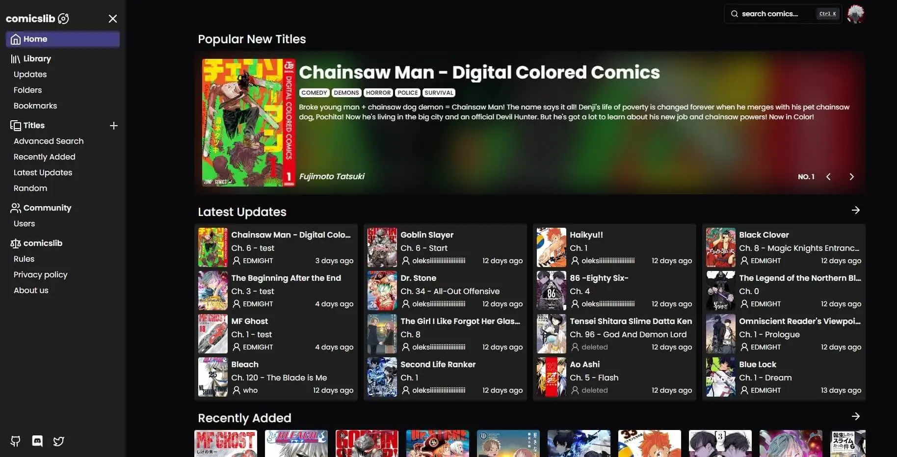

# [comicslib](https://comicslib.vercel.app/)

This application is a personal project inspired by the existing **[MangaDex](https://mangadex.org/)** platform. The primary aim of this development effort was to enhance my skills in building the client-side using **Next.js 13.4**. It's important to note that **all materials** utilized in this application were directly sourced from **[MangaDex](https://mangadex.org/)**.

[](https://comicslib.vercel.app/)

> **Warning**
> This project is still in development and is not ready for production use.
>
> The authorization flow on the client side can, in theory, fail during soft page updates

## Tech Stack

- **Client Framework:** [Next.js](https://nextjs.org)
- **Server Framework:** [Express.js](https://expressjs.com/)
- **Styling:** [Tailwind CSS](https://tailwindcss.com)
- **ORM:** [Prisma](https://www.prisma.io/)
- **UI Components:** [shadcn/ui](https://ui.shadcn.com)
- **Content Management:** [Contentlayer](https://www.contentlayer.dev)

## Features to be implemented

- [x] Authentication flow using **[JWT tokens](https://jwt.io/)** (SSR and CSR)
- [x] OAuth-based authentication via **[Google](https://developers.google.com/identity/protocols/oauth2)** and **[GitHub](https://docs.github.com/en/apps/oauth-apps/building-oauth-apps/authorizing-oauth-apps)** integration
- [x] Processing files using **[React Cropper](https://www.npmjs.com/package/react-cropper)** and **[React Dropzone](https://www.npmjs.com/package/react-dropzone)**
- [x] Static pages using **MDX** and **[Contentlayer](https://contentlayer.dev/)**
- [x] Client validation with **[Zod](https://zod.dev/)**
- [x] Infinite scroll pagination with **[React Query](https://tanstack.com/query/v4/docs/react/reference/useInfiniteQuery)**
- [x] Drag & drop elements with **[dnd kit](https://dndkit.com/)**
- [x] Carousels using **[Embla Carousel](https://www.embla-carousel.com/)**
- [ ] Containerization with **[Docker](https://www.docker.com/)**

## Running Locally

1. Clone the repository

   ```bash
   git clone https://github.com/EDMIGHT/comicslib.git
   ```

2. Install dependencies to server folder **(relative to root)**

   ```bash
   cd server
   yarn
   ```

3. Copy the `.env.example` to `.env` and update the variables **(server folder)**.

   ```bash
   cp .env.example .env
   ```

4. Push the database schema **(server folder)**.

   ```bash
   yarn push
   ```

5. **(optional)** Filling the database with attributes for comics **(server folder)**.

   ```bash
   yarn seed
   ```

6. Start the development server **(server folder)**

   ```bash
   yarn dev
   ```

7. Install dependencies to client folder **(relative to root)**

   ```bash
   cd client
   yarn
   ```

8. Copy the `.env.example` to `.env.local` and update the variables **(client folder)**.

   ```bash
   cp .env.example .env.local
   ```

9. Start the development server **(client folder)**

   ```bash
   yarn dev
   ```

## How do I deploy this?

- **The client part is hosted on:** [Vercel](https://vercel.com/docs/deployments/overview)
- **The server part is hosted on:** [Microsoft Azure](https://azure.microsoft.com/en-us)
- **The database is hosted on:** [Planetscale](https://planetscale.com/docs/tutorials/planetscale-quick-start-guide)
- **Media files are hosted on:** [Cloudinary](https://cloudinary.com/documentation/node_integration)

## Known, yet unresolved issues

1. In the case of a soft page refresh, the access token may not be updated, as such a page does not pass through the middleware where we have the capability to preserve tokens. In practice, such a scenario should not occur, as a soft refresh only happens when the user interacts with the page, and this is already the client-side, where cookies are updated using an axios interceptor

2. The Dockerfile for the client should only trigger a build when the server container for generating ISR pages is ready. Attempts to add a 'healthcheck' property to the docker-compose file or use a 'wait-for' utility to check the server's readiness did not yield the desired results.

## License

Licensed under the MIT License. Check the [LICENSE](./LICENSE.md) file for details.
